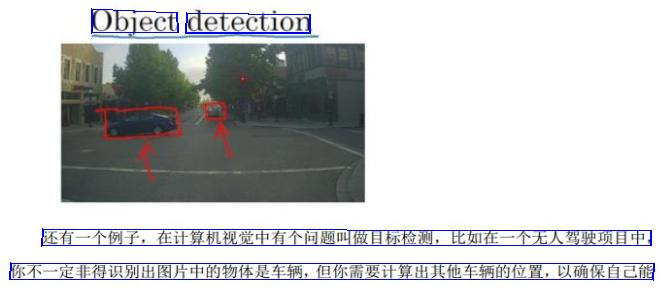
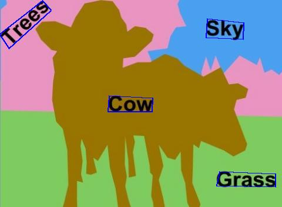

# ocr_chinese
Keras实现自然场景下图像文字检测和识别，EAST/CRNN/CTC.

代码都是使用Keras+后端TensorFlow实现，方便生产环境部署和维护；

- EAST模型实现文字检测，文字方向支持90° ~ -90°间任意角度，包含中字/英文/数字/符号等，目标检测的方式画框定位，返回文本框的四个坐标。
- CRNN模型实现不定长文字识别，输出使用CTC算法模块。
- TensorFlow自带CTC，算法原理可以参考我的博客[CTC算法在OCR文字识别上的应用]( https://felixbrave.github.io/ )，还有[其他博文]( https://xiaodu.io/ctc-explained/ )


### 开发环境

```shell
python3.6 + tensorflow1.14.0 + keras2.1.6
# 或使用pip环境复制
pip install -r environment.txt
# GPU环境
NVIDIA Drivers/CUDA/cuDNN
```

###  How to use

从输入一张图片到端到端的检测及识别文字

```python
python predict.py
```

- 当检测比较正的文本，且是书面文字（不是艺术字），准确率比较高，主要确保EAST模型框选文本正确，不要框选不全，涉及模型训练和超参数调试，具体看Training部分；




- 当检测存在角度的文本，确定文本四个顶点的坐标，旋转及边缘延伸，确保输入CRNN模型时文字完整性；




可以看到输入CRNN时裁剪下来的文字图片；


EAST模型检测文本框

```
cd east
python predict.py
```

CRNN模型识别文字

```
cd crnn
python predict.py
```


### 代码结构

```shell
- crnn										# 文字识别模型
|-- predict_crnn.py 			# 预测文字，衔接east模型，裁剪及文字旋转
|-- data									# 数据集预处理
|-- net										# crnn网络实现及训练，char_std_5990.txt文字对应标签序
|-- model									# 模型weights
- east								  	# 文字检测模型
｜-- predict_east.py  		 # 预测文字位置，画框 
｜-- data								 # images数据集预处理
｜-- net									 # east网络实现及训练，network/loss/training
｜-- model								 # 模型weights
- predict.py							# 实现end-to-end预测，模型衔接
```

### Documents

Writing ......

#### Training


### 参考

- [AdvancedEAST]( https://github.com/huoyijie/AdvancedEAST )
- [Pytorch_CRNN]( https://github.com/AstarLight/Lets_OCR/tree/master/recognizer/crnn )
- [CHINESE-OCR]( https://github.com/xiaofengShi/CHINESE-OCR )